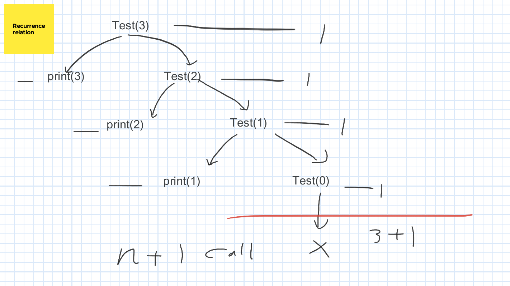
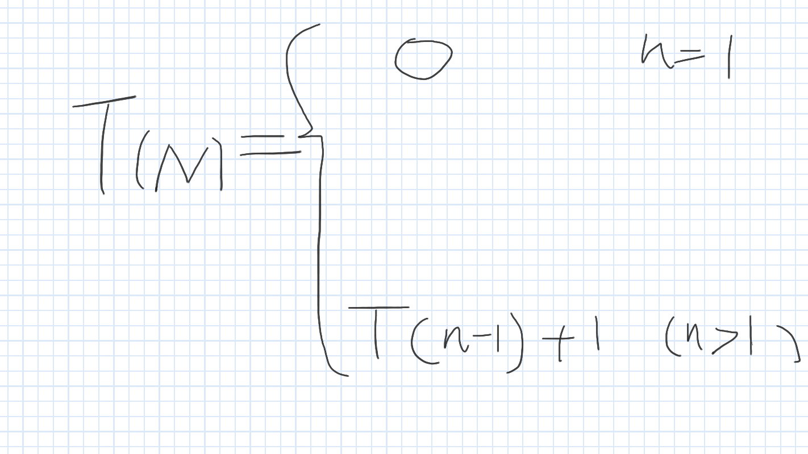

# The note of Algorithms
This is the note for an online YouTube course produced by [Abdul Bari](https://www.youtube.com/watch?v=4V30R3I1vLI&list=PLDN4rrl48XKpZkf03iYFl-O29szjTrs_O&index=19).

Using [Google jamboard](https://jamboard.google.com/?pli=1) to draw graph during my learning process.
# Chapters
## Chapter 2: Divide and Conquer 
### Lesson 1: Divide and Conquer
[The basic conception of divide and conquer](https://youtu.be/2Rr2tW9zvRg?feature=shared)
#### The whole idea of Divide and conquer and **combine**:
1. Split the problem into sub problems.
2. Solve the sub problems one by one, in order to get the answer of each sub problems.
3. **Combine** the answers into one answer, which is the most important thing in the whole process of solving the problem. 


#### The algorithm of DAC

```plaintext

DAC(P){
    if isSmall(P){
        Solve(P)
    }else{
        Divide P into P1,P2,P3
        Apply DAC(P1), DAC(P2), DAC(P3) 
        Combine(DAC(P1),DAC(P2),DAC(P3))       
    }
    
}

``` 

#### Examples of the Divide and Conquer Algorithm
1. Binary Search
2. Finding Maximum and Minimum 
3. Merge sort
4. Quick sort
5. Strassen's Matrix Multiplication


### Lesson 2.1.1: Recurrence Relation
The link of this lesson on youtube on be found [here](https://www.youtube.com/watch?v=4V30R3I1vLI&list=PLDN4rrl48XKpZkf03iYFl-O29szjTrs_O&index=19)
The topic of the lesson is about how to trace the recurrence algorithm by using recurrence tree and formula, and how to calculate the time complexity of a recurrence relation.
#### A Recurrence Relation represented by code

```plaintext
// Print the value of N recursively.
void Test(int n){
    if(n > 0){
        print(n)
        Test(n-1)
    }
}
```
1. Using tree to trace and represent the recurrence relation

From the draw, we can learn that the time complexity of this recurrence relation is O(N), since the function is called by N + 1 times.
2. Using recurrence formula to present the algorithm
```plaintext
void Test(int n){                      -- T(N)
    if(n > 0){                         -- 
        print(n)                       -- 1
        Test(n-1)                      -- T(N-1)
    }
}
------------------------------------------------------
------------------------------------   -- T(N) = 1 + T(N-1)
```
But how about the condition if(n > 0)? It is not listed in the formula?
How to prove the recurrence formula? 


```plaintext
T(N) = T(N-1) + 1

Substitute T(N-1) = T(N-2) + 1
so:
T(N) = [T(N-2) + 1] + 1
T(N) = T(N-2) + 2
T(N) = [T(N - 3) + 1] + 2 
T(N) = T(N - 3) + 3
....
T(N) = T(N - K) + K

Asssume : N - K = 0 , so N = K
then:
T(N) = T(0) + K
Because T(0) = 1
then:
T(N) = 1 + K
Because N = K
T(N) = 1 + N
```


#### The idea of recurrence relation
### Lesson 2.1.2:
### Lesson 2.1.3:
### Lesson 2.1.4:
### Lesson 2.1.5:
### Lesson 2.1.6:

## Chapter 3 Greedy method
## Chapter 4 Dynamic programming
## Chapter 5 Graph Traversals
## Chapter 6 Backtracking
## Chapter 7 Branch and Bound
## Chapter 8 NP-Hard and NP-Complete
## Chapter 9 KMP String matching
## Chapter 10 AVL Tree
## Chapter 11 B Tree and B+ Trees